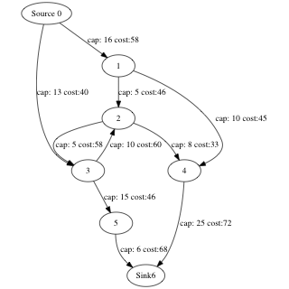
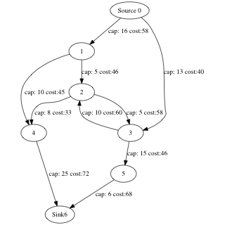

<!--
 * @Author: Lin Sinan
 * @Github: https://github.com/linsinan1995
 * @Email: mynameisxiaou@gmail.com
 * @LastEditors: Lin Sinan
 * @Description: 
 *               
 *               
 *               
--> 
# MCMF algorithm with C++ 17

This project is for my course of Operations Research in Unice, and it includes three algorithm:

- Maximum flow

- Minimum cut

- Min cost max flow

Beyond the printed result, I also add a module to generate GraphViz-parsable scripts to generate an animated GIF.

# 1. How to compile

## 1.1.CMAKE

```
mkdir build
cd build
cmake ..
make
./test
```

If you don't want to generate GraphViz scripts(save an amount of time), comment out `add_definitions( -DGRAPHVIZ )` in CMakeLists.txt.

## 1.2.GCC

generate GraphViz scripts

```
g++ -std=c++17 main.cpp -o test
```

Don't generate GraphViz scripts
```
g++ -DGRAPHVIZ -std=c++17 main.cpp -o test
```


# 2. Notice

- Don't support self-loop and redundant edges(multiple arc between s and t) cases.

- Node index should be 0 to numVertices-1, if not => use

```
cat data.txt | python preprocess.py > newdata.txt
```

to generate a new data file.

# 3. Usage and Demo

## 3.1.Maximum flow

```cpp
#include "include/graph.h"
using namespace mcmf;

int main()
{
    Graph graph = Graph().build(path);
    int maximum_flow = graph.maximum_flow();
    std::cout << "maximum flow: " << maximum_flow << "\n";
}
```

output:
```
===========================
         Iter 1
6 <- 4 <- 1 <- 0
path flow: 10
total flow: 10
===========================

...

===========================
         Iter 4
6 <- 4 <- 2 <- 3 <- 0
path flow: 3
total flow: 24
===========================

maximum flow: 24
```




## 3.2.Minimum cuts

```cpp
std::string path {"data/data2.in"};
Graph graph = Graph().build(path);
graph.minimum_cut();
```

output:
```
cut: 2->5
cut: 3->5
cut: 6->7
```



## 3.3.Minimum cost


```cpp
std::string path {"data/data2.in"};
Graph graph = Graph().build(path);
graph.min_cost_flow();
```

ouput:
```
===========================
         Iter 1
flow:6
cost:154
6<-5<-3<-0
===========================

...

===========================
         Iter 4
flow:1
cost:209
6<-4<-2<-1<-0
===========================

maximum flow: 24
total cost: 4318
```


# 4.Visualization

using macro `GRAPHVIZ` can generate a graphViz scripts, and generate a gif picture based on [GraphvizAnim](https://github.com/mapio/GraphvizAnim).

- first, make sure adding GRAPHVIZ macro(-DGRAPHVIZ) to compile

- second, run function `toGraphViz`

```cpp
Graph graph = Graph().build(path);
graph.min_cost_flow();
graph.toGraphViz("log.out");
```

- third, inistall GraphvizAnim, and run python code to generate gif picture

```
pip install GraphvizAnim
```

e.g.
```
python -m gvanim log.out maximum_flow
```

# 5.Algorithm

# 5.1.Maximum flow

1. Set `total flow` as 0 in the beginning.

2. Repeat until there is no path from source to sink:

    1) run BFS from source to find a path to sink.

    2) find the minimum capacity flow `f` on the path.

    3) add flow `f` to `total flow`

    4) Update redisual flows of edges(u->v) on the path
        ```
        residual_flow(u->v) -= f
        residual_flow(v->u) += f
        ```
3. Return flow when no available path can be found.

# 5.2.Minimum cut

1. Run maximum flow algorithm, and get the final residual graph.

2. By using DFS to find a path from the source to sink on the residual graph.

3. Edges can be minimum cut if their source node is non-reachable node, and sink node is reachable.

# 5.3.Min cost max flow


1. Initialize `total cost` and `total flow` as 0.

2. First build a residual cost graph by adjacent list, since there may be multiple edges in an arc.

```
cost = cost[u][v]
cost(u->v) = cost;
cost(v->u) = -1*cost;
```

3. While we can find an available cost-lowest path by Bellman-Ford.

    1) Find the minimum capacity flow `f` on the path, and update residual flow of edges on the path.

    2) Add maximum flow of the path to `total flow`

    3) Add the cost of the path to `total cost`
    ```
    total cost += f * minimum_cost
    ```

4. Return maximum flow and minimum cost when no available path can be found.


