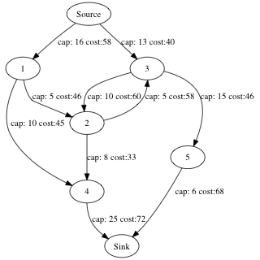

<!--
 * @Author: Lin Sinan
 * @Github: https://github.com/linsinan1995
 * @Email: mynameisxiaou@gmail.com
 * @LastEditors: Lin Sinan
 * @Description: 
 *               
 *               
 *               
--> 
# Operations Research Project

# 1. How to compile

## 1.1.CMAKE

```
mkdir build
cd build
cmake ..
make
./test
```

If you don't want to generate GraphViz scripts, comment out `add_definitions( -DGRAPHVIZ )` in CMakeLists.txt,
which takes an amount of time.

## 1.2.GCC

generate GraphViz scripts

```
g++ -std=c++17 main.cpp -o test
```

Don't generate GraphViz scripts
```
g++ -DGRAPHVIZ -std=c++17 main.cpp -o test
```


# 2. Notice

- Don't support self-loop and redundant edges(multiple arc between s and t) cases.

- Node index should be 0 to numVertices, if not => `cat data.txt | python3 preprocess.py > newdata.txt`

# 3. Usage and Demo

## 3.1.Maximum flow

```cpp
int main()
{
    Graph graph = Graph().build(path);
    int maximum_flow = graph.maximum_flow();
    std::cout << "maximum flow: " << maximum_flow << "\n";
}
```

output:
```
===========================
         Iter 1
6 <- 4 <- 1 <- 0
path flow: 10
total flow: 10
===========================

...

===========================
         Iter 4
6 <- 4 <- 2 <- 3 <- 0
path flow: 3
total flow: 24
===========================

maximum flow: 24
```




## 3.2.Minimum cuts

```cpp
std::string path {"data/data2.in"};
Graph graph = Graph().build(path);
graph.minimum_cut();
```

output:
```
cut: 2->5
cut: 3->5
cut: 6->7
```


## 3.3.Minimum cost


```cpp
std::string path {"data/data2.in"};
Graph graph = Graph().build(path);
graph.min_cost_flow();
```

ouput:
```
===========================
         Iter 1
flow:6
cost:154
6<-5<-3<-0
===========================

...

===========================
         Iter 4
flow:1
cost:209
6<-4<-2<-1<-0
===========================

maximum flow: 24
total cost: 4318
```


# 4.Visualization

using macro `GRAPHVIZ` can generate a graphViz scripts, and generate a gif picture based on [GraphvizAnim](https://github.com/mapio/GraphvizAnim).

- first, make sure adding GRAPHVIZ macro(-DGRAPHVIZ) to compile

- second, run function `toGraphViz`

```cpp
Graph graph = Graph().build(path);
graph.min_cost_flow();
graph.toGraphViz("log.out");
```

- third, run python code to generate gif picture

e.g.
```
python3 -m gvanim log.out maximum_flow
```